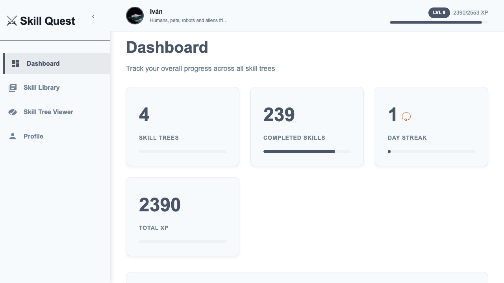

# 🌳 Skill Quest - Gamified Skill Tree Progress Tracker

[](https://ivanr3d.com/demo/skilltree.html) [](LICENSE) [](CONTRIBUTING.md)

## Table of Contents
  - [📖 About Skill Quest](#-about-skill-quest)
  - [📊 Current Project Status](#-current-project-status)
  - [🚀 Project Vision & Future Goals](#-project-vision--future-goals)
  - [🚧 Roadmap](#-roadmap)
  - [👥 Contributing](#-contributing)
  - [🛠️ Getting Started](#-getting-started)
  - [📖 Documentation](#-documentation)
  - [🌟 Community](#-community)
  - [📄 License](#-license)
  - [🙏 Acknowledgments](#-acknowledgments)
  - [📬 Contact](#-contact)

## 🎯 What is This Project?

**Skill Quest** is an interactive, gamified web application that helps you visualize and track your learning progress through skill trees. Designed to work with [MakerSkillTree](https://github.com/sjpiper145/MakerSkillTree) SVG files, it takes the concept of skill trees — visual learning paths — and adds gamification elements to make learning more engaging and rewarding. Think of it as a "RPG for real-life skills" where you:

- **Visualize** your learning path as interactive skill trees
- **Track progress** with XP, levels, and achievements
- **Stay motivated** with streaks, badges, and activity tracking
- **Manage** multiple skill trees across various categories



### 🔗 Connection to MakerSkillTree

Maker Skill Trees are **printable templates** that can you can use to visualize your skill progress, identify skill gaps and get inspired to try new things. Skill Quest attempts to **digitalize** the process of creating and sharing skill trees.

This tool is specifically designed to work with SVG files generated by the [MakerSkillTree Generator](https://schme16.github.io/MakerSkillTree-Generator/), creating a seamless workflow from skill tree creation to progress tracking.

## 📊 Current Project Status

### ✅ **What Works Today**
- **Local Progress Tracking**: Full-featured offline-first application using LocalStorage
- **Skill Tree Management**: Import, organize, and categorize SVG skill trees
- **Gamification System**: 
  - XP & Level progression
  - Achievement unlocking
  - Daily streaks
  - Visual effects (particles, confetti)
- **Interactive Viewer**: Click-to-complete skills with customizable colors
- **Dashboard Analytics**: Comprehensive stats and activity tracking
- **Data Management**: Import/export functionality and profile customization
- **Responsive Design**: Works on desktop and mobile devices

### 🏗️ **Architecture**
[](index.html) [](https://developer.mozilla.org/docs/Web/API/Window/localStorage) [](style.css) [](#)

## 🚀 Project Vision & Future Goals

### **Current State**: Local Progress Tracking Tool
Today, Skill Quest is a **personal tool** that helps individuals track their learning progress locally. Users can:
- Import skill trees from [MakerSkillTree](https://github.com/sjpiper145/MakerSkillTree)
- Track personal learning metrics
- Visualize their progress
- Maintain their data locally

### **Future Vision**: Online Gamified Learning Community
We envision transforming Skill Quest into a **collaborative learning platform** where users can:

#### 🎮 Enhanced Gamification
- **Community Leaderboards**: Compare progress with others
- **Collaborative Challenges**: Team-based learning quests
- **Skill-based Matchmaking**: Connect with peers learning similar skills
- **Reward Marketplace**: Exchange XP for learning resources

#### 🤝 Social & Collaborative Features
- **Skill Completion Sharing**: Post when you complete skills with resources used
- **Learning Resource Database**: Crowd-sourced links, tutorials, and materials
- **Study Groups**: Create or join groups for specific skill trees
- **Mentor Matching**: Connect beginners with experienced learners

#### 📚 Resource Sharing System
- **Resource Attribution**: Tag resources (videos, articles, courses) to specific skills
- **Quality Voting**: Community-voted best resources for each skill
- **Learning Path Recommendations**: AI-suggested resources based on your progress
- **Progress Journals**: Document your learning journey for each skill

#### ☁️ Cloud & Sync Features
- **Cloud Backup**: Sync progress across devices
- **Public Profiles**: Share your skill tree progress publicly
- **API Access**: For developers to build integrations
- **Data Export**: To portfolio websites or LinkedIn

## 🚧 Roadmap

### Phase 1: Foundation (Current)
- [x] Local progress tracking
- [x] Basic gamification
- [x] SVG skill tree support
- [x] Responsive design

### Phase 2: Community Features (In Progress)
- [ ] User authentication
- [ ] Cloud sync
- [ ] Public profiles
- [ ] Basic resource sharing

### Phase 3: Advanced Platform
- [ ] Learning resource database
- [ ] Community challenges
- [ ] Advanced analytics
- [ ] Mobile application

### Phase 4: Ecosystem
- [ ] API for third-party integrations
- [ ] Learning platform partnerships
- [ ] Certification system
- [ ] Marketplace for learning resources

## 👥 Contributing
We are **actively seeking developers, designers, and content creators** to help us make Skill Quest the best learning tool it can be. If you're interested, please check out our [Contributing Guidelines](CONTRIBUTING.md) for more details. Depending your profile, here is a list of ideas we are looking for:

- **Designers**:
  - UI/UX improvements. As you will notice, it is currently very miniamlist and colorless, there are plenty opportunities to make it more visually appealing and interesting.

- **Developers**:
  - Frontend development. We are currently using pure HTML, CSS, and JS for the frontend to make it accesible to any developer with the basic knowledge of web tech. We welcome any contribution to implement design ideas or new features.
  - Backend development. We are currently using LocalStorage for data management, but in order to accomplish future goals, we need help to develop a backend system to handle user accounts, data sync, and API integrations.

- **Content Creators**:
We still don't have the infraestructure to link learning resources to specific skills but you can help us create a comprehensive resource database where users can find the best resources for each skill. Here are some ideas we are looking for:

  - Tutorials and guides for specific skills
  - Video tutorials and guides
  - Blog posts and articles
  - Learning resources (books, courses, etc.)

It can be resources already created or you can help us create them.

### How to Contribute
1. Fork the repository
2. Create a feature branch (`git checkout -b feature/AmazingFeature`)
3. Commit your changes (`git commit -m 'Add some AmazingFeature'`)
4. Push to the branch (`git push origin feature/AmazingFeature`)
5. Open a Pull Request

Please read our [Contributing Guidelines](CONTRIBUTING.md) for details.

## 🛠️ Getting Started

### Prerequisites
- Web browser (Chrome, Firefox, Safari, Edge)
- SVG files from [MakerSkillTree Generator](https://schme16.github.io/MakerSkillTree-Generator/)

### Installation
1. **Clone the repository**:
   ```bash
   git clone https://github.com/ivanr3d/skill-quest.git
   ```

2. **Navigate to the project directory**:
   ```bash
   cd skill-quest
   ```

3. **Open `index.html`** in your browser.

4. **Start adding and tracking your skills!**

### Basic Usage
1. **Add Your First Skill Tree**:
   - Go to "Skill Library"
   - Click "Add Skill Tree"
   - Upload an SVG from [MakerSkillTree](https://github.com/sjpiper145/MakerSkillTree)
   - Categorize and describe your skill tree

2. **Track Your Progress**:
   - Click "View" on any skill tree
   - Click skill nodes to mark them as completed
   - Watch your XP and level increase

3. **Monitor Your Stats**:
   - Check the Dashboard for overall progress
   - View badges and achievements
   - Track your daily streak

## 📖 Documentation

For detailed technical documentation, architecture overview, and code explanations, see [PROJECT_DOCS.md](PROJECT_DOCS.md).

## 🌟 Features in Detail

### Gamification System
- **Progressive Leveling**: XP requirements increase as you level up
- **Achievement Badges**: Unlock badges for milestones
- **Daily Streaks**: Maintain consistency with streak tracking
- **Visual Rewards**: Confetti and particle effects for accomplishments

### Skill Tree Management
- **Multiple Categories**: Programming, Design, Language, Music, Fitness, Other
- **Search & Filter**: Easily find specific skill trees
- **Progress Visualization**: Color-coded completion status
- **Score Tracking**: XP earned per tree

### Data Management
- **LocalStorage**: All data persists in your browser
- **Import/Export**: Backup and restore your progress
- **Profile Customization**: Personalize your experience
- **Activity Log**: Timeline of all your learning activities

## 🤝 Community

[Future plans]

## 📄 License

This project is licensed under the MIT License - see the [LICENSE](LICENSE) file for details.

## 🙏 Acknowledgments

- [MakerSkillTree](https://github.com/sjpiper145/MakerSkillTree) for the inspiration and SVG format
- All contributors who help improve this tool
- The open-source community for invaluable resources and inspiration

## 📬 Contact

Project Maintainer: [Iván R. Artiles]

- GitHub: [@ivanr3d](https://github.com/ivanr3d)
- Email: hi@ivanr3d.com

---

**Made with ❤️ for the learning community. Level up your skills, one node at a time!**

<div align="center">
  <sub>If you find this project useful, please consider giving it a ⭐ on GitHub!</sub>
</div>